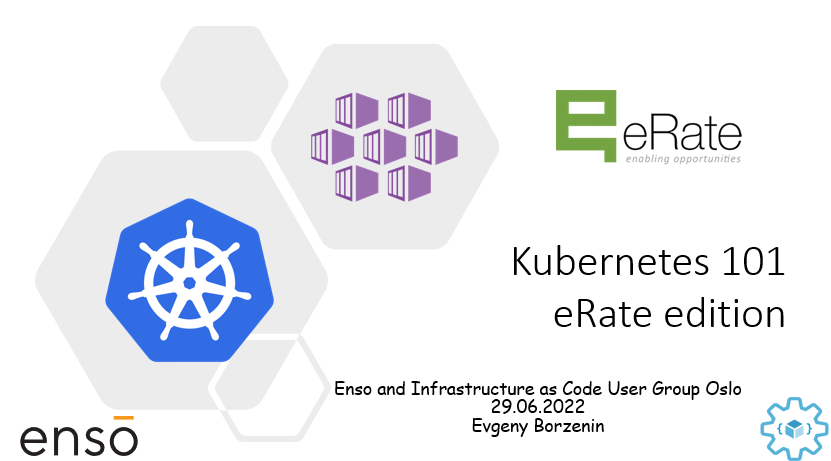

# Kubernetes 101 eRate edition 

This is introduction level (101) workshop for those of you who have never worked with Kubernetes. I expect that you have some basic understanding of containerization concept and know what docker and docker images are. 

This workshop covers the basics of using Kubernetes and here is the agenda:

## Agenda

 * Welcome and intro
 * Slides: Kubernetes (and AKS) introduction
 * [Lab-01](labs/lab-01/readme.md): connecting to AKS cluster
 * Lab-02: setting up your shell (powershell and zsh/bash) for better AKS/kubectl experience 
 * Slides: introduce "guinea pig" app
 * [Lab-03](labs/lab-03/readme.md): Containerizing your application
 * Slides: Pods, Namespaces
 * [Lab-04](labs/lab-04/readme.md): Creating, managing and testing pods
 * Lab-05: Working with namespaces
 * Slides: Kubernetes Resource Management
 * [Lab-06](labs/lab-06/readme.md): Working with Kubernetes Resource Management
 * Slides: Readiness and Liveness probes
 * [Lab-07](labs/lab-07/readme.md): Configuring Readiness and Liveness probes
 * Slides: Kubernetes Deployments
 * [Lab-08](labs/lab-08/readme.md): Deployments
 * Slides: Services, Labels, Selectors
 * [Lab-09](labs/lab-09/readme.md): Creating and Managing Services
 * Slides: ConfigMaps and secrets
 * [Lab-10](labs/lab-10/readme.md): Working with ConfigMaps and secrets
 * Slides: Kubernetes Ingress 
 * [Lab-11](labs/lab-11/readme.md): configuring ingress with nginx
 * Slides: Scaling options in Kubernetes
 * [Lab-12](labs/lab-12/readme.md): scale applications manually
 * [Lab-13](labs/lab-13/readme.md): use Horizontal Pod Autoscaling (HPA) to automatically scale applications
 * Slides: Kubernetes Event-driven Autoscaling KEDA 
 * Slides: GitOps with Flux (optional)

## Prerequisites

Please spend some time, install and configure [prerequisites](prerequisites.md).
