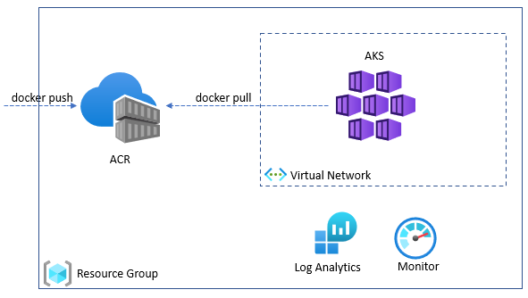
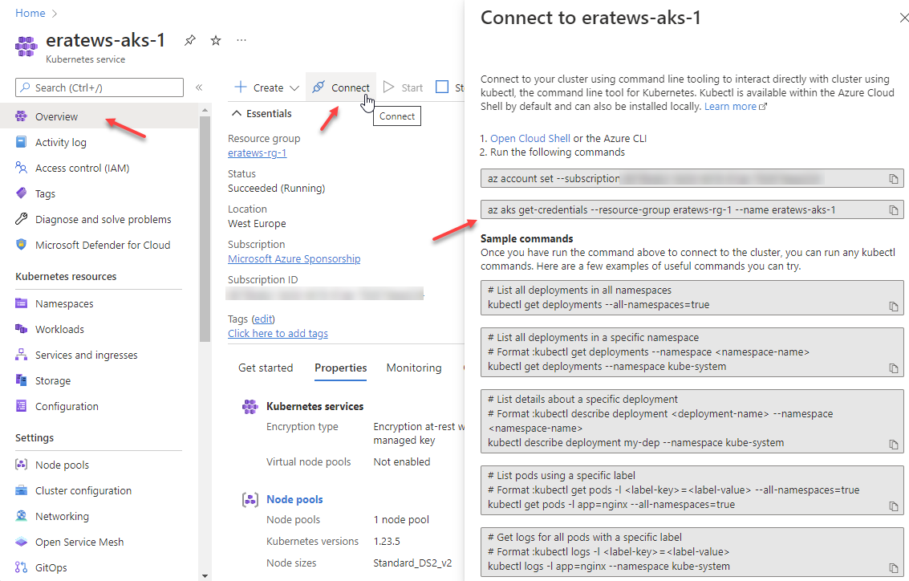
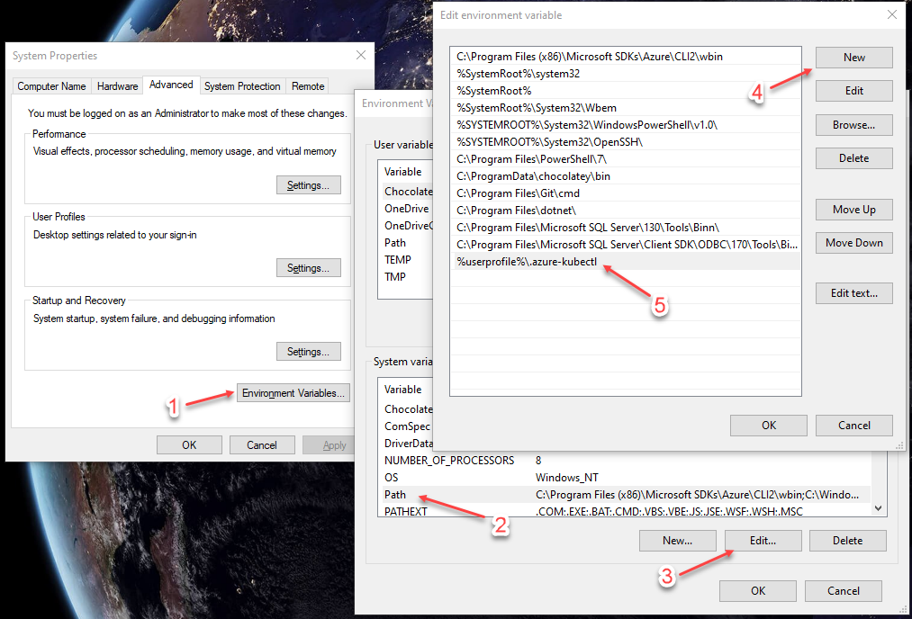

# lab-01 - connecting to AKS cluster 

## Estimated completion time - 15 min

To start learning and experimenting with Kubernetes concepts, commands and operations, we need Azure Kubernetes Service (AKS) cluster. I provisioned one AKS cluster per attendee and here is the list of additional supported resources provision for each cluster: 

* Azure Resource Group
* Azure Container Registry (ACR)
* Azure Kubernetes Service (AKS)



## Goals

* Install `kubectl` command 
* Connect to AKS cluster
* Use `kubectl` and get list of nodes and namespaces

## Task #1 - connect to the cluster

To configure `kubectl` to connect to your Kubernetes cluster, use the [az aks get-credentials](https://docs.microsoft.com/en-us/cli/azure/aks?view=azure-cli-latest&WT.mc_id=AZ-MVP-5003837#az_aks_get_credentials) command. This command downloads credentials and configures the Kubernetes CLI to use them.

If you forget how to connect to the cluster, you can always find it at the portal from the `Connect` tab.



```bash
# Set your user ID
export WS_USER_ID=<YOUR_ID>

# Get access credentials for AKS
az aks get-credentials --resource-group eratews-rg-$WS_USER_ID --name eratews-aks-$WS_USER_ID
```

## Task #2 - install kubectl

To manage a Kubernetes cluster, you need `kubectl`, the Kubernetes command-line client. To install kubectl locally, use the [az aks install-cli](https://docs.microsoft.com/en-us/cli/azure/aks?view=azure-cli-latest&WT.mc_id=AZ-MVP-5003837#az_aks_install_cli) command. 

```bash
# Install kubectl
az aks install-cli
```

If you are running on Mac or WSL, you may need to use `sudo`, in this case run 

```bash
# Install kubectl using sudo
sudo az aks install-cli
```

If you are using PowerShell, you need to update system PATH environment variable and add new item for `%userprofile%\.azure-kubectl`. 



* Open the Start Search, type in `env`, and choose `Edit the system environment variables`
* Click the `Environment Variables…` button.
* Select `Path` variable under `System variables` section
* CLick `Edit...`
* Click `New` and set variable to `%userprofile%\.azure-kubectl`

You need to reset your PowerShell (and cmd) session(s) for change to take effect.

For a complete list of kubectl operations, see [Overview of kubectl](https://kubernetes.io/docs/reference/kubectl/overview/).


## Task #3 - verify the connection to your cluster

To verify the connection to your cluster, let's use the `kubectl get` commands to return a list of the cluster nodes and namespaces

```bash
# Get nodes
kubectl get nodes
NAME                             STATUS   ROLES   AGE   VERSION
aks-system-25235226-vmss000000   Ready    agent   2d    v1.23.5
aks-system-25235226-vmss000001   Ready    agent   2d    v1.23.5

# Get namespaces
NAME              STATUS   AGE
calico-system     Active   2d
default           Active   2d
kube-node-lease   Active   2d
kube-public       Active   2d
kube-system       Active   2d
tigera-operator   Active   2d
```

## Useful links

* [Azure Container Registry documentation](https://docs.microsoft.com/en-us/azure/container-registry/?WT.mc_id=AZ-MVP-5003837)
* [Azure Kubernetes Service (AKS)](https://docs.microsoft.com/en-us/azure/aks/?WT.mc_id=AZ-MVP-5003837)
* [Quickstart: Deploy an Azure Kubernetes Service cluster using the Azure CLI](https://docs.microsoft.com/en-us/azure/aks/kubernetes-walkthrough?WT.mc_id=AZ-MVP-5003837)
* [Tutorial: Deploy and use Azure Container Registry](https://docs.microsoft.com/en-us/azure/aks/tutorial-kubernetes-prepare-acr?WT.mc_id=AZ-MVP-5003837)
* [Authenticate with Azure Container Registry from Azure Kubernetes Service](https://docs.microsoft.com/en-us/azure/aks/cluster-container-registry-integration?WT.mc_id=AZ-MVP-5003837)
* [az aks install-cli](https://docs.microsoft.com/en-us/cli/azure/aks?view=azure-cli-latest?WT.mc_id=AZ-MVP-5003837#az_aks_install_cli)
* [Overview of kubectl](https://kubernetes.io/docs/reference/kubectl/overview/)

## Next: setting up your shell for better AKS/kubectl experience

[Go to lab-02](../lab-02/readme.md)