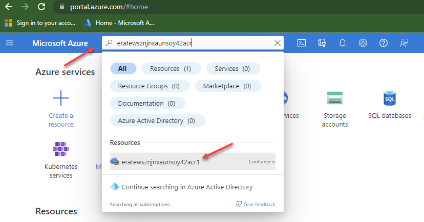
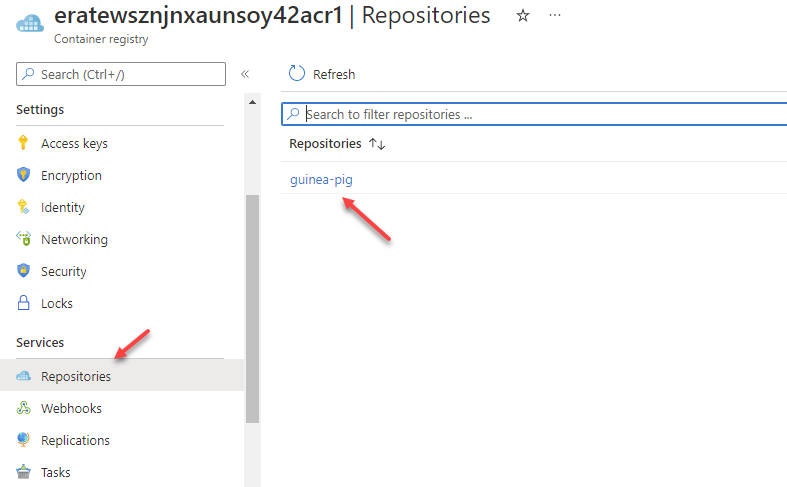
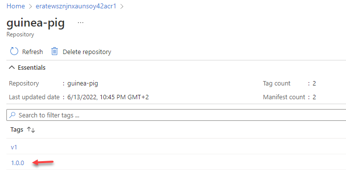
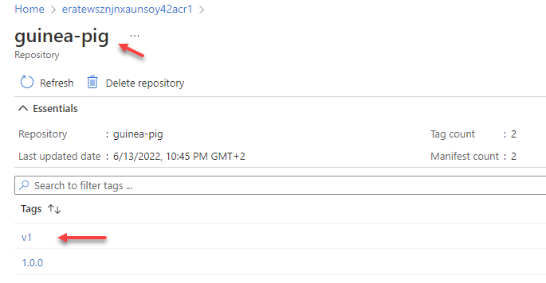

# lab-03 - Containerizing your application

## Estimated completion time - 15 min

To work with Kubernetes and learn `kubectl` commands we need a test application. I created the simplest default version of `ASP.NET Core Web API` app and extended it with a couple of additional controllers that we will need in later labs. During this lab you will package application as Docker image and push image to the Azure Container Registry (ACR). This application will be our `guinea pig` application we will use with all further labs.

## Goals

* Get familiar with our test web api application
* Add Docker support 
* Learn how to build docker image
* Learn how to build and push docker image to Azure Container Registry with Docker and `az acr build` command 

## Prerequisites

First, check that the following prerequisites are installed:

* Download and install [Docker for Windows](https://docs.docker.com/docker-for-windows/install/)

or 

* Download and install [Docker for Mac](https://www.docker.com/products/docker-desktop/)

## Task #1 - get and build application

First, clone repository with application code to your PC. You can either clone it, or fork it out and then clone.

```bash
# Get application code using ssh
git@github.com:Infrastructure-AsCode/aks-101.git
```

If you experiencing some issues with `ssh`, try to clone using `https`.

```bash
# Get application code using https 
https://github.com/Infrastructure-AsCode/aks-101.git
```

Test application is located under `src\` folder. You can use Visual Studio Community edition, Rider or Visual Studio Code as an IDE to work with dotnet code.

Navigate to the `src` folder and build it using `dotnet` cli.

```bash
# Build app
dotnet build app.sln
```

## Task #2 - build and publish image with Docker command

You can publish image to Azure Container Registry using Docker cli.
Run the following command from within `src\GuineaPig` project folder.

```bash
# Use the Dockerfile to build a new guinea-pig image.
docker build -t guinea-pig:1.0.0 -f Dockerfile ..

# Get list of available images, check that new image is in the list
docker image list
```

After building the image, use Docker to verify that it works as expected.

```bash
# Start an instance of your newly created docker image.
docker run -d guinea-pig:1.0.0

# Use docker ps to get the container's ID
docker ps

CONTAINER ID   IMAGE              COMMAND                  CREATED         STATUS         PORTS     NAMES
801431e6b88c   guinea-pig:1.0.0   "dotnet GuineaPig.dll"   7 seconds ago   Up 6 seconds   80/tcp    flamboyant_margulis
```

Push the Image to ACR

```bash
# login to ACR
az acr login --name eratewsznjnxaunsoy42acr<YOUR_ID>
Login Succeeded

# Use docker tag to create an alias of the image with the fully qualified path to your ACR registry.
docker tag guinea-pig:1.0.0 eratewsznjnxaunsoy42acr<YOUR_ID>.azurecr.io/guinea-pig:1.0.0

# Now that you've tagged the image with the fully qualified path to your private registry, you can push it to the registry with docker push
docker push eratewsznjnxaunsoy42acr<YOUR_ID>.azurecr.io/guinea-pig:1.0.0
```
If command runs successful, navigate to Azure portal and search for your ACR (eratewsznjnxaunsoy42acr<YOUR_ID>). You can use search at the top of the portal 



Navigate to `Repositories` and select repository `guinea-pig` repo. 




`guinea-pig` repository should have `1.0.0` tag of the `guinea-pig` image.




## Task #3 - build and publish container images with `az acr build` command

Another way to build and push your images is by using [az acr build](https://docs.microsoft.com/en-us/cli/azure/acr?view=azure-cli-latest&WT.mc_id=AZ-MVP-5003837#az_acr_build) cli command. To do so, run the following command from within the `src\GuineaPig` project folder. Note, that this time we used `:v1` as a image version.

```bash
# Build and push app to ACR
az acr build --registry eratewsznjnxaunsoy42acr<YOUR_ID> --image guinea-pig:v1 --file Dockerfile ..
```
If command runs successful, check the ACR at the Azure portal. Now `guinea-pig` repository should have 2 tags of the `guinea-pig` image.



## Useful links

* [Visual Studio 2019 Community Edition](https://visualstudio.microsoft.com/downloads/?WT.mc_id=AZ-MVP-5003837)
* [Download .NET 6.0](https://dotnet.microsoft.com/download/dotnet/6.0?WT.mc_id=AZ-MVP-5003837)
* [Create your first Docker container with an ASP.NET web app](https://tutorials.visualstudio.com/aspnet-container/containerize?WT.mc_id=AZ-MVP-5003837)
* [Visual Studio Container Tools with ASP.NET Core](https://docs.microsoft.com/en-us/aspnet/core/host-and-deploy/docker/visual-studio-tools-for-docker?view=aspnetcore-5.0&WT.mc_id=AZ-MVP-5003837)
* [Container Tools in Visual Studio](https://docs.microsoft.com/en-us/visualstudio/containers/?view=vs-2019&WT.mc_id=AZ-MVP-5003837)
* [How to configure Visual Studio Container Tools](https://docs.microsoft.com/en-us/visualstudio/containers/container-tools-configure?view=vs-2019&WT.mc_id=AZ-MVP-5003837)
* [az acr build command](https://docs.microsoft.com/en-us/cli/azure/acr?view=azure-cli-latest&WT.mc_id=AZ-MVP-5003837#az_acr_build)
* [Push your first image to a private Docker container registry using the Docker CLI](https://docs.microsoft.com/en-us/azure/container-registry/container-registry-get-started-docker-cli?WT.mc_id=AZ-MVP-5003837)

## Next: Creating, managing and testing pods

[Go to lab-04](../lab-04/readme.md)