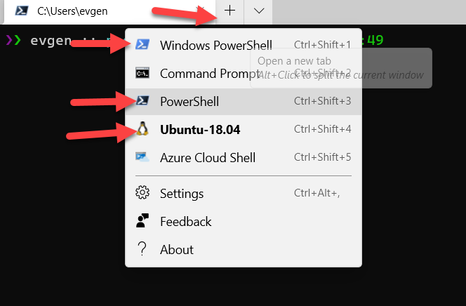
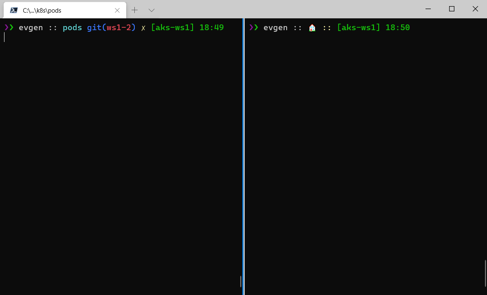
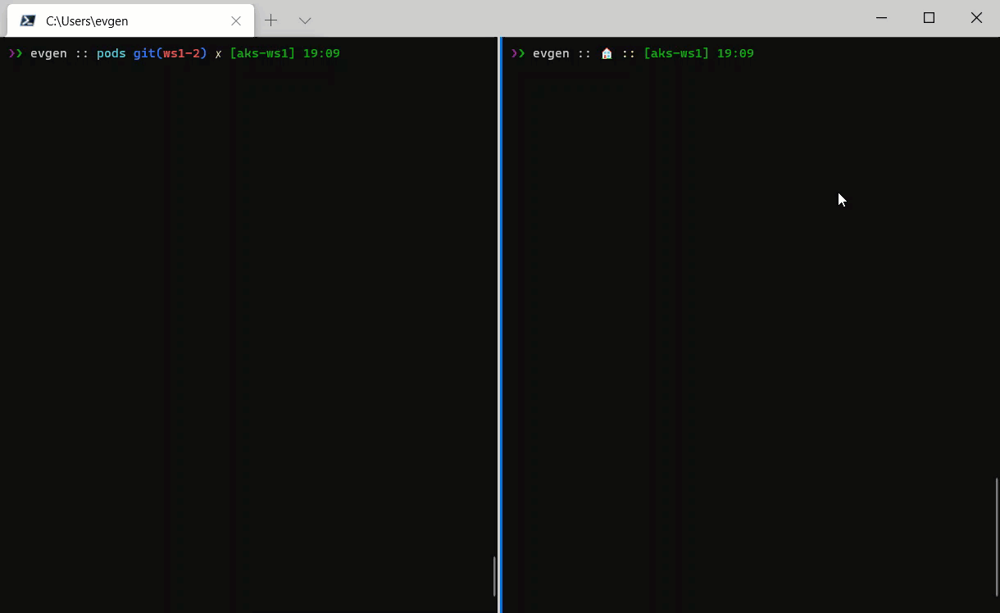
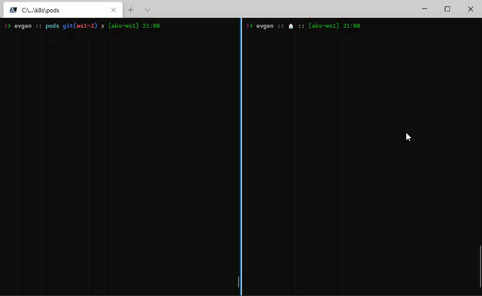

# lab-04 - Creating, managing and testing pods

## Estimated completion time - 15 min

At the core of Kubernetes is the Pod. Pods represent a logical application and hold a collection of one or more containers. 

## Goals

In this lab you will learn how to:

* run application at AKS
* get list of pods
* get detailed information about the pod
* get pod description
* delete pods
* run pod as interactive shell for testing and debugging your apps
* get logs from the pod
* create pod from yaml definition file
* use port forward to test pod

## Task #0 - (only for Windows users) - setting up Windows Terminal

For the most of the labs, I recommend you to use Windows Terminal, because it allows to split Terminal windows in two (and more) sessions. One will be used to run all commands included into the labs. In the second window you will run `kubectl get ... -w` command in watching mode to get a realtime feedback about what kubernetes does behind the scene.

You can install Windows Terminal from the [Microsoft Store](https://aka.ms/terminal). When installed, start it, maximize it (so you have enough space) and select shell of your choice.



To split current window, enter `Shift+Alt+D` and it will split your current window either vertically or horizontally:



In the right-hand session, run the "watcher" command:

```bash
# Watch what happens with pods
kubectl get pods -w
```

This command will be running and watching all state changes inside the cluster in regards to pods. 

At the left-hand session, run all commands from the labs. 



## Task #1 - run image from ACR in AKS

Now that we published several versions of out application images into ACR, and our AKS cluster is integrated with ACR, we can run our application inside the AKS

```bash
# Set your user ID
export WS_USER_ID=<YOUR_ID>

# Run pod guinea-pig
kubectl run guinea-pig-lab4-task1 --image eratewsznjnxaunsoy42acr$WS_USER_ID.azurecr.io/guinea-pig:v1
pod/guinea-pig-lab4-task1 created
```

As you can see, Kubernetes is reporting that `pod` `guinea-pig` was created.

## Task #2 - get information about pods

To get all pods, use the following command

```bash
# List all pods 
kubectl get pod
NAME                      READY   STATUS    RESTARTS   AGE
guinea-pig-lab4-task1     1/1     Running   0          5s
```

as you can see, there is one pods running, have status `Running` and `Ready` column contains `1/1`, which means that 1 out of 1 containers are in `Running` state. 
To get even more information about pods, use `-o wide` flag

```bash
# List all pods with expanded (aka "wide") output
kubectl get po -o wide
NAME                      READY   STATUS    RESTARTS   AGE    IP          NODE                             NOMINATED NODE   READINESS GATES
guinea-pig-lab4-task1     1/1     Running   0          71s    10.1.0.54   aks-system-14344459-vmss000001   <none>           <none>
```

as you can see, now report contains additional information about pods, such as IP address and name of the node where pods were created.

## Task #3 - get detailed information about pod 

You can get information about concrete pod by running 

```bash
# Get pod guinea-pig
kubectl get po guinea-pig-lab4-task1

# Note, I used `po` instead of `pod`. This is alias that you can use to save some keystrokes. Another alias is `pods` :)
# Get guinea-pig-lab4-task1 pod with expanded (aka "wide") output
kubectl get po guinea-pig-lab4-task1 -o wide

# Describe pod with verbose output
kubectl describe pod guinea-pig-lab4-task1

# Get pod guinea-pig-lab4-task1 definition as YAML
kubectl get po guinea-pig-lab4-task1 -o yaml

# Get pod guinea-pig-lab4-task1 definition json
kubectl get po guinea-pig-lab4-task1 -o json
```

## Task #4 - testing within cluster with interactive shell. Option #1

Quite often you need to test application from within your cluster. Because cluster is running inside it's own Private Virtual Network, it's not accessible from your PC. To prove this, try to ping one of the running `guinea-pig` pods IP.

```bash
# Get guinea-pig-lab4-task1 pod IP addresses (you will have a different IP)
kubectl get po guinea-pig-lab4-task1 -o jsonpath='{.status.podIP}'
10.1.0.27

# try to ping `guinea-pig`
ping 10.1.0.27

Pinging 10.1.0.27 with 32 bytes of data:
Request timed out.
```

How can we test our application? One common solution is to run a test pod that you can attach to and run interactive shell commands from inside the pod. There are several well known images for such a tasks, one of them called [busybox](https://busybox.net/), but the image we will use is [busyboxplus:curl](https://hub.docker.com/r/radial/busyboxplus). Mainly because it contains `curl` command that we need for our testing. 

```bash
# Run pod as interactive shell
kubectl run curl -i --tty --rm --restart=Never --image=radial/busyboxplus:curl -- sh

# Here is prompt from withing the pod
[ root@curl:/ ]$ 

# Now, try to ping the same IP
[ root@curl:/ ]$ ping 10.1.0.27
PING 10.1.0.27 (10.1.0.27): 56 data bytes
64 bytes from 10.1.0.27: seq=0 ttl=63 time=0.102 ms
64 bytes from 10.1.0.27: seq=1 ttl=63 time=0.120 ms
64 bytes from 10.1.0.27: seq=2 ttl=63 time=0.069 ms
^C
--- 10.1.0.27 ping statistics ---
3 packets transmitted, 3 packets received, 0% packet loss
round-trip min/avg/max = 0.094/0.107/0.134 ms

# Exit from the pod
[ root@curl:/ ]$ exit
pod "curl" deleted
```

Couple of things to mention here:

1. As expected, IP address is now accessible from inside the pod. 
2. The `curl` pod was deleted when we exit. This is because of  `--rm` flag that tells Kubernetes to delete pod created by this command.

## Task #5 - deploy `guinea-pig` image using pod manifest file 

Create new `guinea-pig-lab4-task5-pod.yaml` file with the following pod definition content

```yaml
apiVersion: v1
kind: Pod
metadata:
  name: guinea-pig-lab4-task5
spec:
  containers:
  - name: api
    image: eratewsznjnxaunsoy42acr<YOUR_ID>.azurecr.io/guinea-pig:v1
    resources: {}
```

Now deploy it using [kubectl apply](https://kubernetes.io/docs/reference/generated/kubectl/kubectl-commands#apply) command

```bash
# Deploy guinea-pig-lab4-task1 pod
kubectl apply -f guinea-pig-lab4-task5-pod.yaml
pod/guinea-pig-lab4-task5 created
```

## Task #6 - test your application

As we already know, we can't just test our application, because it's not accessible from our PC. We need to run our `curl` pod with interactive shell and do all testing from there.

```bash
# Get guinea-pig-lab4-task1 pod IP address
kubectl get po guinea-pig-lab4-task1 -o json | jq -r .status.podIP

# or
kubectl get po guinea-pig-lab4-task1 -o jsonpath='{.status.podIP}'

# or
kubectl get po guinea-pig-lab4-task1 -o wide

10.1.0.27

# Start our test `curl` pod
kubectl run curl -i --tty --rm --restart=Never --image=radial/busyboxplus:curl -- sh

# Test http://10.1.0.54/api endpoint
[ root@curl:/ ]$ curl http://10.1.0.54/api
[api] - OK.

# exit from the pod
[ root@curl:/ ]$ exit
pod "curl" deleted
```

## Task #7 - get pod logs

You can dump pod logs by running [kubectl logs](https://kubernetes.io/docs/reference/generated/kubectl/kubectl-commands#logs) command

```bash
# dump pod logs (stdout)
kubectl logs guinea-pig-lab4-task1
[19:35:50 INF] Now listening on: http://[::]:80
[19:35:50 INF] Application started. Press Ctrl+C to shut down.
[19:35:50 INF] Hosting environment: Production
[19:35:50 INF] Content root path: /app
```

You can also stream logs by using `-f` flag. 
Stop `kubectl get po -w` command at the right-hand window and run the following command instead

```bash
# Stream logs from pod guinea-pig
kubectl logs guinea-pig-lab4-task1 -f
[19:35:50 INF] Now listening on: http://[::]:80
[19:35:50 INF] Application started. Press Ctrl+C to shut down.
[19:35:50 INF] Hosting environment: Production
[19:35:50 INF] Content root path: /app
```

Now repeat `Task #6` inside your left-hand Terminal window. This time repeat `curl http://...` command several times and observe the right "monitoring" session, you should see new logs coming.

```bash
# Get IP address of the guinea-pig-lab4-task1 pod
kubectl get po guinea-pig-lab4-task1 -o jsonpath='{.status.podIP}'
10.1.0.27

# Start our test `curl` pod
kubectl run curl -i --tty --rm --restart=Never --image=radial/busyboxplus:curl -- sh

# Test http://10.1.0.27/api endpoint
[ root@curl:/ ]$ curl http://10.1.0.27/api
[ root@curl:/ ]$ curl http://10.1.0.27/api
[ root@curl:/ ]$ curl http://10.1.0.27/api
[ root@curl:/ ]$ curl http://10.1.0.27/api
[ root@curl:/ ]$ curl http://10.1.0.27/api

# exit from the pod
[ root@curl:/ ]$ exit
pod "curl" deleted
```



## Task #8 - use Port Forwarding to test your application in a cluster

Here is another technique you can use to test your applications. It's called [Port Forwarding](https://kubernetes.io/docs/tasks/access-application-cluster/port-forward-access-application-cluster/) and it allows you to access and interact with internal Kubernetes cluster processes from your localhost. The following command will start listening on port 7000 on the local machine and forward traffic to port 80 on `guinea-pig` running in the cluster

```bash
# Listen on port 7000 on the local machine and forward to port 80 on guinea-pig
kubectl port-forward guinea-pig-lab4-task1 7000:80
Forwarding from 127.0.0.1:7000 -> 80
Forwarding from [::1]:7000 -> 80
```

Now open new terminal (or split your current windows with `Shift+Alt+D`). In new terminal run the following command

```bash
curl http://localhost:7000/api
```

## Task #9 - delete pod

To delete pod use [kubectl delete](https://kubernetes.io/docs/reference/generated/kubectl/kubectl-commands#delete) command. There are several ways you can delete pod, here are two common one:

```bash
# Delete single pod
kubectl delete pod guinea-pig-lab4-task1
pod "guinea-pig-lab4-task1" deleted

# Delete a pod using the type and name specified in guinea-pig-lab4-task5-pod.yaml
kubectl delete -f guinea-pig-lab4-task5-pod.yaml
pod "guinea-pig-lab4-task5" deleted
```

## Useful links

* [Kubernetes Pods](https://kubernetes.io/docs/concepts/workloads/pods/)
* [kubectl Cheat Sheet](https://kubernetes.io/docs/reference/kubectl/cheatsheet/)
* [kubectl apply](https://kubernetes.io/docs/reference/generated/kubectl/kubectl-commands#apply)
* [kubectl run](https://kubernetes.io/docs/reference/generated/kubectl/kubectl-commands#run)
* [kubectl delete](https://kubernetes.io/docs/reference/generated/kubectl/kubectl-commands#delete)
* [kubectl logs](https://kubernetes.io/docs/reference/generated/kubectl/kubectl-commands#logs)
* [kubectl exec](https://kubernetes.io/docs/reference/generated/kubectl/kubectl-commands#exec)
* [Interacting with running Pods](https://kubernetes.io/docs/reference/kubectl/cheatsheet/#interacting-with-running-pods)
* [Formatting output](https://kubernetes.io/docs/reference/kubectl/cheatsheet/#formatting-output)
* [Use Port Forwarding to Access Applications in a Cluster](https://kubernetes.io/docs/tasks/access-application-cluster/port-forward-access-application-cluster/)

## Next: Working with Namespaces

[Go to lab-05](../lab-05/readme.md)