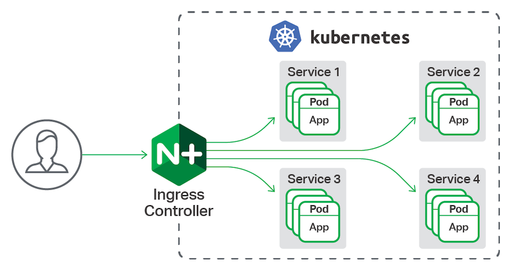

# lab-11 - configuring ingress with nginx

An ingress controller is a piece of software that provides reverse proxy, configurable traffic routing, and TLS termination for Kubernetes services. Kubernetes ingress resources are used to configure the ingress rules and routes for individual Kubernetes services. Using an ingress controller and ingress rules, a single IP address can be used to route traffic to multiple services in a Kubernetes cluster.



## Goals

This lab shows you how to deploy the NGINX ingress controller in an AKS cluster. The ingress controller is configured on an internal, private virtual network and IP address. No external access is allowed. Two applications are then run in the AKS cluster, each of which is accessible over the single IP address.

You will learn how to:

* Install and configure NGINX ingress controller
* Implement `ingress` routes to expose kubernetes services 

## Task #0 - install helm

If you don't have `helm` installed, install it:

### For Windows, use `Chocolatey`
```powershell
# For Windows, use Chocolatey
choco install kubernetes-helm
```

### For Ubuntu, use Apt

```bash
# For Ubuntu, use Apt
curl https://baltocdn.com/helm/signing.asc | sudo apt-key add -
sudo apt-get install apt-transport-https --yes
echo "deb https://baltocdn.com/helm/stable/debian/ all main" | sudo tee /etc/apt/sources.list.d/helm-stable-debian.list
sudo apt-get update
sudo apt-get install helm
```

### For Mac, use brew

```bash
brew install helm
```

## Task #1 - deploy NGINX ingress controller

Create `internal-ingress.yaml` with the following content. 

```yaml
controller:
  replicaCount: 2
  service:
    annotations:
      service.beta.kubernetes.io/azure-load-balancer-internal: "true"
  tolerations:
    - key: "CriticalAddonsOnly"
      operator: "Equal"
      value: "true"
      effect: "NoSchedule"
  nodeSelector: 
    kubernetes.io/os: linux
  admissionWebhooks:
    patch:
      nodeSelector: 
        kubernetes.io/os: linux    
defaultBackend:
  nodeSelector: 
    kubernetes.io/os: linux
```

Since ingress controller is business critical component, I want to deploy it to the system nodes, therefore I need to configure `tolerations`. I also want to specify more than one replica count, in our case it's two.

Deploy NGINX ingress controller using helm. 

```bash
# Add the ingress-nginx repository
helm repo add ingress-nginx https://kubernetes.github.io/ingress-nginx

# Use Helm to deploy an NGINX ingress controller
helm install nginx-ingress ingress-nginx/ingress-nginx --namespace kube-system -f internal-ingress.yaml

# Check that all pods are up and running. 
kubectl -n kube-system get po -l app.kubernetes.io/name=ingress-nginx
NAME                                                     READY   STATUS    RESTARTS   AGE
nginx-ingress-ingress-nginx-controller-9f4f5dc77-hnvlv   1/1     Running   0          143m
nginx-ingress-ingress-nginx-controller-9f4f5dc77-tvdhk   1/1     Running   0          143m

# Check load balancer external ip
kubectl --namespace kube-system get services -o wide -w nginx-ingress-ingress-nginx-controller
NAME                                     TYPE           CLUSTER-IP     EXTERNAL-IP   PORT(S)                      AGE    SELECTOR
nginx-ingress-ingress-nginx-controller   LoadBalancer   10.0.151.123   10.1.0.66     80:31235/TCP,443:32741/TCP   143m   app.kubernetes.io/component=controller,app.kubernetes.io/instance=nginx-ingress,app.kubernetes.io/name=ingress-nginx
```

It may take a few minutes for the LoadBalancer IP to be available. Initially, `EXTERNAL-IP` column will contain `<pending>`, but when Azure Load Balancer will be created and IP address will be assigned, `EXTERNAL-IP` will contain private IP address, in my case it was `10.1.0.66`. 

No ingress rules have been created yet, so the NGINX ingress controller's default 404 page is displayed if you browse to the internal IP address. Ingress rules are configured in the following tasks.

```bash
# Start curl pod with interactive shell
kubectl run curl -i --tty --rm --restart=Never --image=radial/busyboxplus:curl -- sh

# Try to access our ingress IP. Note that you have to use your IP address
[ root@curl:/ ]$ curl http://10.1.0.66
<html>
<head><title>404 Not Found</title></head>
<body>
<center><h1>404 Not Found</h1></center>
<hr><center>nginx</center>
</body>
</html>
[ root@curl:/ ]$ exit
```

To see the ingress controller in action, let's deploy two applications in our AKS cluster. 


## Task #2 - deploy guinea-pig application  

Create `lab-11-task2-deployment.yaml` manifest file with the following k8s resources:

```yaml
apiVersion: apps/v1
kind: Deployment
metadata:
  name: lab-11-task2
  labels:
    app: lab-11-task2
spec:
  replicas: 1
  selector:
    matchLabels:
      app: lab-11-task2
  template:
    metadata:
      labels:
        app: lab-11-task2
    spec:
      containers:
      - name: api
        image: eratewsznjnxaunsoy42acr.azurecr.io/guinea-pig:v1
        imagePullPolicy: IfNotPresent
        resources: {}
---
apiVersion: v1
kind: Service
metadata:
  name: lab-11-task2-service
  labels:
    app: lab-11-task2
spec:
  ports:
  - port: 8081
    protocol: TCP
    targetPort: 80
  selector:
    app: lab-11-task2
  type: ClusterIP
```

```bash
# Deploy lab-11-task2 application
kubectl apply -f lab-11-task2-deployment.yaml
deployment.apps/lab-11-task2 created
service/lab-11-task2-service created
```

As you can see, here we deployed two replicas of lab-11-task2 and service exposed at port `8081`. Now, let's test it:

```bash
# Start test pod with interactive shell
kubectl run curl -i --tty --rm --restart=Never --image=radial/busyboxplus:curl -- sh

# Test api
[ root@curl:/ ]$ curl http://lab-11-task2-service:8081/api
[api] - OK.
[ root@curl:/ ]$ exit
```
## Task #3 - implement an ingress route

Create `lab-11-task3-ingress.yaml` file with the following ingress manifest:

```yaml
apiVersion: networking.k8s.io/v1
kind: Ingress
metadata:
  name: lab-11-task3-ingress
  namespace: default
  annotations:
    nginx.ingress.kubernetes.io/ssl-redirect: "false"
    nginx.ingress.kubernetes.io/use-regex: "true"
    nginx.ingress.kubernetes.io/rewrite-target: /
spec:
  ingressClassName: nginx
  rules:
  - http:
      paths:
      - path: /
        pathType: Prefix      
        backend:
          service:
            name: lab-11-task2-service
            port:
              number: 8081
```

```bash
# Deploy lab-11-task3-ingress ingress  
kubectl apply -f lab-11-task3-ingress.yaml 
ingress.networking.k8s.io/lab-11-task3-ingress created
```
It may take some time before private IP address is assigned to the ingress, you can watch the status by running the following command:

```bash
# Get all ingresses
kubectl get ingress -w
NAME              CLASS   HOSTS   ADDRESS   PORTS   AGE
NAME                   CLASS   HOSTS   ADDRESS   PORTS   AGE
lab-11-task3-ingress   nginx   *                 80      0s
lab-11-task3-ingress   nginx   *       10.1.0.66   80      28s

# Get lab-11-task3-ingress ingresses
kubectl get ingress lab-11-task3-ingress

# Describe lab-11-task3-ingress ingress
kubectl describe ing lab-11-task3-ingress
```

Now, let's test the ingress controller:

```bash
# Get ingress IP address
kubectl get ingress lab-11-task3-ingress
NAME            CLASS   HOSTS   ADDRESS       PORTS   AGE
lab-11-task3-ingress   nginx   *       10.1.0.66   80      11m

# Start test pod with interactive shell
kubectl run curl -i --tty --rm --restart=Never --image=radial/busyboxplus:curl -- sh

# Test api endpoint
[ root@curl:/ ]$ curl http://10.1.0.66/api
[api-b] - OK
[ root@curl:/ ]$ exit
```

## Task #4 - implement multiple ingress routes

First, let's deploy another version of `guinea-pig` application with service. 

Create `lab-11-task4-deployment.yaml` manifest file with the following k8s resources:

```yaml
apiVersion: apps/v1
kind: Deployment
metadata:
  name: lab-11-task4
  labels:
    app: lab-11-task4
spec:
  replicas: 1
  selector:
    matchLabels:
      app: lab-11-task4
  template:
    metadata:
      labels:
        app: lab-11-task4
    spec:
      containers:
      - name: api
        image: eratewsznjnxaunsoy42acr.azurecr.io/guinea-pig:v1
        imagePullPolicy: IfNotPresent
        resources: {}
---
apiVersion: v1
kind: Service
metadata:
  name: lab-11-task4-service
  labels:
    app: lab-11-task4
spec:
  ports:
  - port: 8081
    protocol: TCP
    targetPort: 80
  selector:
    app: lab-11-task4
  type: ClusterIP
```

```bash
# Deploy lab-11-task4 application
kubectl apply -f lab-11-task4-deployment.yaml
deployment.apps/lab-11-task4 created
service/lab-11-task4-service created
```

Now, create `lab-11-task4-ingress.yaml` file with the following ingress manifest:

```yaml
apiVersion: networking.k8s.io/v1
kind: Ingress
metadata:
  name: lab-11-task4-ingress
  namespace: default
  annotations:
    nginx.ingress.kubernetes.io/ssl-redirect: "false"
    nginx.ingress.kubernetes.io/use-regex: "true"
    nginx.ingress.kubernetes.io/rewrite-target: /$2
spec:
  ingressClassName: nginx
  rules:
  - http:
      paths:
      - path: /apia(/|$)(.*)
        pathType: Prefix      
        backend:
          service:
            name: lab-11-task2-service
            port:
              number: 8081
      - path: /apib(/|$)(.*)
        pathType: Prefix      
        backend:
          service:
            name: lab-11-task4-service
            port:
              number: 8081
```

In this ingress definition, any characters captured by (.*) will be assigned to the placeholder `$2`, which is then used as a parameter in the [rewrite-target](https://kubernetes.github.io/ingress-nginx/examples/rewrite/) annotation. The ingress definition above will result in the following rewrites:

* `10.1.0.66/apia` rewrites to `10.1.0.66/`
* `10.1.0.66/apia/` rewrites to `10.1.0.66/`
* `10.1.0.66/apia/api` rewrites to `10.1.0.66/api`
* `10.1.0.66/apib/api` rewrites to `10.1.0.66/api`

```bash
# Deploy lab-11-task3-ingress ingress  
kubectl apply -f lab-11-task4-ingress.yaml 
ingress.networking.k8s.io/lab-11-task4-ingress created

# Describe lab-11-task3-ingress ingress and check the Rules section
kubectl describe ingress lab-11-task4-ingress
```

As you can see in the `Rules`, there are two path pointing to corresponding services

```yaml
Rules:
  Host        Path  Backends
  ----        ----  --------
  *
              /apia(/|$)(.*)   lab-11-task2-service:8081 (10.1.0.41:80)
              /apib(/|$)(.*)   lab-11-task4-service:8081 (10.1.0.53:80)
```

Now, let's test new ingress controller:

```bash
# Get ingress IP address, but as you already noticed, all ingress will have the same private IP used by NGINX ingress controller
kubectl get ingress lab-11-task4-ingress
NAME                   CLASS   HOSTS   ADDRESS     PORTS   AGE
lab-11-task4-ingress   nginx   *       10.1.0.66   80      4m26s

# Start test pod with interactive shell
kubectl run curl -i --tty --rm --restart=Never --image=radial/busyboxplus:curl -- sh

# Test apia endpoint
[ root@curl:/ ]$ curl http://10.1.0.66/apia/api
[api] - OK.

# Test apia endpoint
[ root@curl:/ ]$ curl http://10.1.0.66/apib/api
[api] - OK.

[ root@curl:/ ]$ exit
```

If you monitor logs from `lab-11-task2` and `lab-11-task4` pods, you will see that traffic from `10.1.0.66/apia/api` endpoint is routed to the `lab-11-task2` pod via  `lab-11-task2-service` and traffic from `10.1.0.66/apib/api` endpoint is routed to the `lab-11-task4` pod via `lab-11-task4-service` service.

## Useful links

* [Create an ingress controller to an internal virtual network in Azure Kubernetes Service (AKS)](https://docs.microsoft.com/en-us/azure/aks/ingress-internal-ip?WT.mc_id=AZ-MVP-5003837)
* [Create an HTTPS ingress controller on Azure Kubernetes Service (AKS)](https://docs.microsoft.com/en-us/azure/aks/ingress-tls?WT.mc_id=AZ-MVP-5003837)
* [Create an HTTPS ingress controller and use your own TLS certificates on Azure Kubernetes Service (AKS)](https://docs.microsoft.com/en-us/azure/aks/ingress-own-tls?WT.mc_id=AZ-MVP-5003837)
* [Ingress](https://kubernetes.io/docs/concepts/services-networking/ingress/)
* [About Ingress in Azure Kubernetes Service (AKS)](https://vincentlauzon.com/2018/10/10/about-ingress-in-azure-kubernetes-service-aks/)
* [nginx: Default backend](https://kubernetes.github.io/ingress-nginx/user-guide/default-backend/)
* [nginx: Installation with Helm](https://docs.nginx.com/nginx-ingress-controller/installation/installation-with-helm/)
* [Wait, Which NGINX Ingress Controller for Kubernetes Am I Using?](https://www.nginx.com/blog/wait-which-nginx-ingress-controller-kubernetes-am-i-using/)
* [Taints and Tolerations](https://kubernetes.io/docs/concepts/scheduling-eviction/taint-and-toleration/)
* [Rewrite Target](https://kubernetes.github.io/ingress-nginx/examples/rewrite/)


## Next: scale applications manually

[Go to lab-12](../lab-12/readme.md)