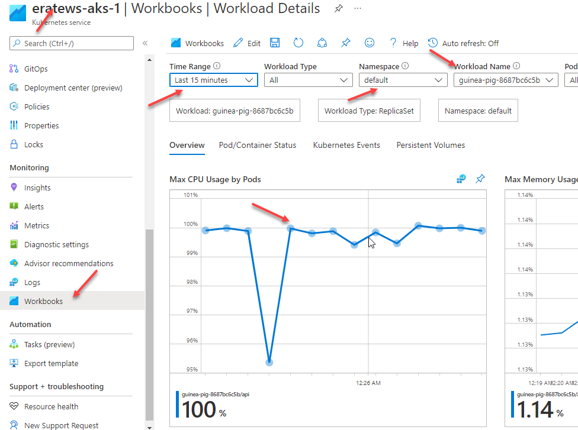

# lab-12 - scale applications manually

You can manually scale replicas (pods) to test how your application responds to a change in available resources and state. Manually scaling resources also lets you define a set amount of resources to use to maintain a fixed cost. To manually scale, you define the replica count. The Kubernetes API then schedules creating additional pods based on that replica count.

## Task #1 - deploy application to cluster

Create new `lab-12-deployment.yaml` manifest file with the following content.

```yaml
apiVersion: apps/v1
kind: Deployment
metadata:
  name: guinea-pig
  labels:
    app: guinea-pig
spec:
  replicas: 1
  selector:
    matchLabels:
      app: guinea-pig
  template:
    metadata:
      labels:
        app: guinea-pig
    spec:
      containers:
      - name: api
        image: eratewsznjnxaunsoy42acr.azurecr.io/guinea-pig:v1
        imagePullPolicy: IfNotPresent
        resources: 
          requests:
            cpu: 200m
          limits:
            cpu: 400m
---
apiVersion: v1
kind: Service
metadata:
  name: guinea-pig-service
  labels:
    app: guinea-pig
spec:
  ports:
  - port: 80
    protocol: TCP
    targetPort: 80
  selector:
    app: guinea-pig
  type: ClusterIP
```

Deploy application into `default` namespace. 

```bash
# Deploy application into default namespace
kubectl apply -f lab-12-deployment.yaml
deployment.apps/guinea-pig created
service/guinea-pig-service created

# Check that pod is up and running
kubectl get po
NAME                            READY   STATUS    RESTARTS   AGE
guinea-pig-8687bc6c5b-whh72     1/1     Running   0          20s

# Check that service was created
kubectl get svc
NAME                   TYPE        CLUSTER-IP    EXTERNAL-IP   PORT(S)    AGE
guinea-pig-service     ClusterIP   10.0.159.18   <none>        80/TCP     34s
```

Now let's test if application is actually up and running. We will use our old freind - [busyboxplus:curl](https://hub.docker.com/r/radial/busyboxplus) image, mainly because it contains `curl` command that we need for our testing. 

```bash
# Run pod as interactive shell
kubectl run curl -i --tty --rm --restart=Never --image=radial/busyboxplus:curl -- sh

# Here is prompt from withing the pod
[ root@curl:/ ]$ 

# Call api endpoint. It should response with "[guinea-pig] - OK."
[ root@curl:/ ]$ curl http://guinea-pig-service/api
[guinea-pig] - OK.
```

In the separate terminal window, watch application logs.

```bash
# Get pod name
kubectl get po
NAME                            READY   STATUS    RESTARTS   AGE
guinea-pig-8687bc6c5b-whh72     1/1     Running   0          20s

# Get guinea-pig application logs
kubectl logs guinea-pig-8687bc6c5b-whh72 -f
[21:26:36 WRN] Failed to determine the https port for redirect.
[19:33:57 INF] [api] - OK.
[19:33:59 INF] [api] - OK.
```

Now let's test another application endpoint from the `busybox` shell.  

```bash
[ root@curl:/ ]$ curl http://guinea-pig-service/api/highcpu
[ root@curl:/ ]$ curl http://guinea-pig-service/api/highcpu
```

You should see new logs appear from `kubectl logs ` window

```bash
kubectl logs guinea-pig-8687bc6c5b-whh72 -f
[21:26:36 WRN] Failed to determine the https port for redirect.
[19:33:57 INF] [api] - OK.
[19:33:59 INF] [api] - OK.
[19:35:27 INF] [api.highcpu] - execution took 14 ms.
[19:35:28 INF] [api.highcpu] - execution took 15 ms.
[19:35:29 INF] [api.highcpu] - execution took 14 ms.
```

## Task #2 - put some load to the application

To get some more metrics, let's put some load to our application by running the following command

```bash
# Generate some load to guinea-pig application
kubectl run -i --tty load-generator --rm --image=busybox --restart=Never -- /bin/sh -c "while sleep 0.01; do wget -q -O- http://guinea-pig-service/api/highcpu > /dev/null; done"
```

This script will run an infinite loop, sending `wget -q -O- http://guinea-pig-service/api/highcpu > /dev/null` query to the `guinea-pig-service` every 0.01 sec. 

Check application logs

```bash
# get pod name
kubectl get po
NAME                          READY   STATUS    RESTARTS   AGE
guinea-pig-8687bc6c5b-whh72   1/1     Running   0          39m

# get application logs
kubectl logs guinea-pig-8687bc6c5b-whh72 -f
[21:44:54 INF] [guinea-pig.highcpu] - execution took 18 ms.
[21:44:54 INF] [guinea-pig.highcpu] - execution took 39 ms.
[21:44:54 INF] [guinea-pig.highcpu] - execution took 18 ms.
[21:44:54 INF] [guinea-pig.highcpu] - execution took 48 ms.
```
You should see a lot of logs coming. Let it run for about 1-2 min. 

Now let's check some pod metrics. Navigate to https://portal.azure.com/, search for your resource group (in my case it's `eratews-rg-1`).


From the resource list, select AKS. IN my case, it's called `eratews-aks-1`


From the left menu, navigate to `Monitoring->Insights`, select `Controllers` tab, set `Time range` to 30 min, filter pods by `guinea-pig`.



By default it shows the `CPU usage (in millicores)` per pod. Since we are now running load test towards our `guinea-pig` app and `api/highcpu` endpoint simulate high CPU operation, pod is now uses 100% of the allocated CPU limits.

## Task #2 - manually scale guinea-pig application to 3 instances

Keep the load script running. 

Now, let's scale `guinea-pig` application to 3 instances and see how it will affect the performance. 

```bash
# Scaling guinea-pig to 3 instances
kubectl scale deployment/guinea-pig --replicas=3

# Check that new pods are up and running
kubectl get po -w
NAME                          READY   STATUS    RESTARTS   AGE
guinea-pig-6c994669b7-4p4b4   1/1     Running   0          7s
guinea-pig-6c994669b7-95n75   1/1     Running   0          7s
guinea-pig-6c994669b7-xnvnr   1/1     Running   0          36m
load-generator                1/1     Running   0          15m
```

Wait about 1-2 mins and check AKS insights again. You should see that now CPU usage is distributed within three pods and overall CPU usage is dropped and our application is performing within acceptable CPU range.


## Task #3 - scale down application to one replica


```bash
# Scaling guinea-pig to 3 instances
kubectl scale deployment/guinea-pig --replicas=1

# Check that we are back to one pod
kubectl get po -w
NAME                          READY   STATUS    RESTARTS   AGE
guinea-pig-6c994669b7-xnvnr   1/1     Running   0          59m
load-generator                1/1     Running   0          38m
```

## Useful links

* [Scaling options for applications in Azure Kubernetes Service (AKS)](https://docs.microsoft.com/en-us/azure/aks/concepts-scale?WT.mc_id=AZ-MVP-5003837)
* [Manually scale pods](https://docs.microsoft.com/en-us/azure/aks/tutorial-kubernetes-scale?WT.mc_id=AZ-MVP-5003837&tabs=azure-cli#manually-scale-pods)
* [kubectl scale](https://kubernetes.io/docs/reference/generated/kubectl/kubectl-commands#scale)

## Next: use Horizontal Pod Autoscaling (HPA) to automatically scale applications

[Go to lab-13](../lab-13/readme.md)